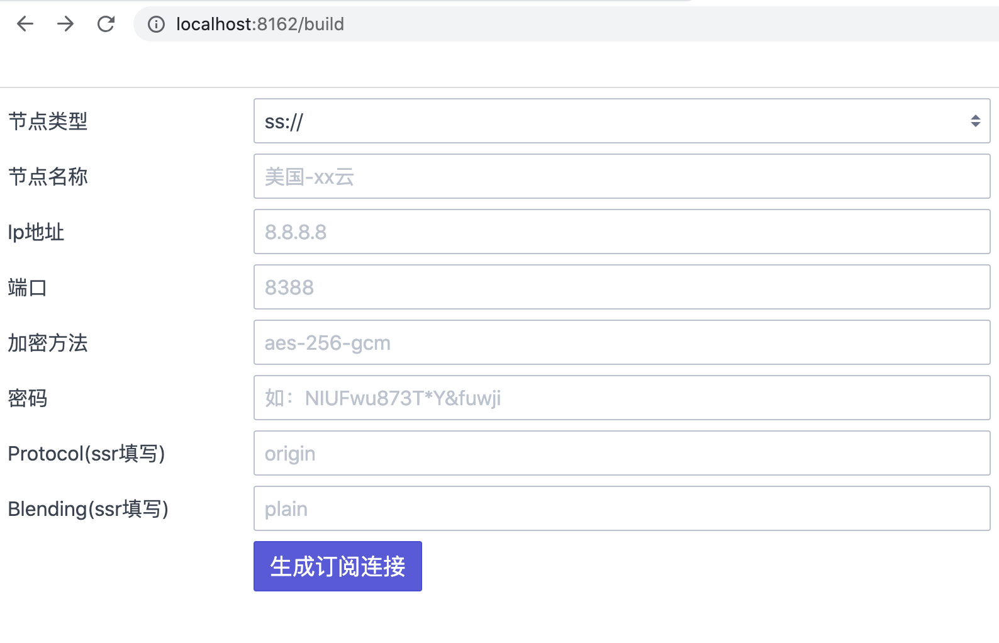
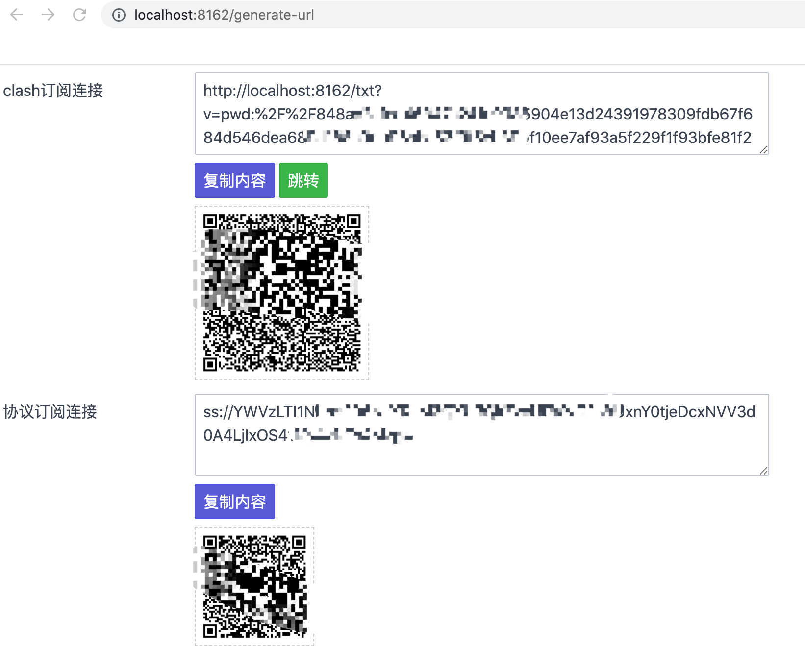

<h1 align="center">
  
</h1>


<p align="center">
  <a href="https://goreportcard.com/report/github.com/icpd/subscribe2clash">
    
  </a>
  
  <a href="https://github.com/icpd/subscribe2clash/releases">
    
  </a>
</p>


## 简介

Clash配置转换，默认自动获取[ACL4SSR](https://github.com/ACL4SSR/ACL4SSR)路由规则。  

支持v2ray\trojan\ss\ssr\ssd订阅转换。**暂不支持单节点转换**  

支持多订阅一起转换，多个订阅连接用英文逗号隔开，链接建议用[URLEncode](https://www.urlencoder.org/)处理。

## 启动服务

### 二进制

- [release](https://github.com/icpd/subscribe2clash/releases)下载对应的版本
- 解压后执行`./subscribe2clash`
- 访问http://localhost:8162/?link=你的订阅链接

### 源码编译

- 安装Go 1.20+
- `go get github.com/icpd/subscribe2clash`
- 进入项目根目录
- 执行 `make build`

## 使用

### 命令行
通过命令生成 Clash 配置，方便在脚本中使用。
```bash
# 通过文件
./subscribe2clash --file=subscribe_file -o=output_file 

# 通过订阅链接
./subscribe2clash --link=subscribe_link -o=output_file

# 只输出节点信息
./subscribe2clash --link=subscribe_link -o=output_file  --nodeonly
```


### web服务
启动一个 HTTP 服务，访问 http://localhost:8162/clash?link=你的订阅链接 即可获取 Clash 配置。
只输出节点信息 http://localhost:8162/clash?nodeonly=1&link=你的订阅链接

```bash
./subscribe2clash
```

### docker 方式部署
#### 将代码打包成docker镜像
```docker
docker build -f Dockerfile -t subscribe2clash:latest .
```
#### 一键docker部署 ss + subscribe2clash + caddy
> 通过同时部署多个服务，最大化利用单个节点
> 
> docker一键配置 同时提供ss服务和订阅连接生成服务
> 
> 通过caddy 自动申请https证书 防止配置信息泄漏

- 进入docker目录
- 将.env.default 重命名为 .env 并修改域名(填写域名并将域名指向你的服务器会自动申请https证书) 和 ss密码等信息
- 执行 docker-compose -f docker-compose.yml up -d 启动服务
- 访问 http://localhost:8162/build 填写ss配置信息（.env中的配置,ss服务默认端口8388） 生成 clash订阅连接
- 在客户端上加载订阅连接


<br>


#### 项目docker编译方式
```
docker build -f Dockerfile -t clashurl:v1 .
```

## 其它
- 指定自定义基础配置文件，可在里面添加自定义的路由规则，程序将按照这个文件写入路由信息。可参考[internal/acl/config/default_base_config.yaml](https://github.com/icpd/subscribe2clash/blob/master/internal/acl/config/default_base_config.yaml) ，`{{.}}`将被程序替换为ACL的路由规则。

  ```
  ./subscribe2clash -b ./yourfile.yaml
  ```

- 指定自定义碎片路由配置文件，可在该配置文件中自定义添加ACL碎片规则文件。可参考[internal/acl/config/default_rules.ini](https://github.com/icpd/subscribe2clash/blob/master/internal/acl/config/default_rules.ini)

  ```
  ./subscribe2clash -r ./yourfile.ini
  ```

- 指定输出的配置文件。默认情况下配置文件会输出为`./config/acl.yaml`，可以通过以下命令来重新指定。

  ```
  ./subscribe2clash -o ./yourconfig.yaml
  ```


- 启用http代理。由于网络原因，ACL的github源可能连接不上，你可能需要配合代理一起食用。

  ```
  ./subscribe2clash -proxy http://127.0.0.1:7890
  ```

- 指定服务监听地址，默认监听`127.0.0.1:8162`端口。

  ```
  ./subscribe2clash -l 127.0.0.1:8162
  ```

- 指定更新规则频率，单位小时，默认每6小时拉取一次。

  ```
  ./subscribe2clash -t 6
  ```